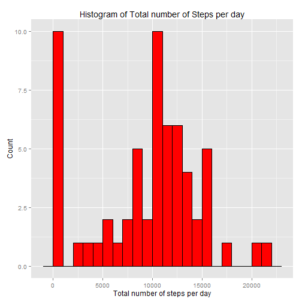
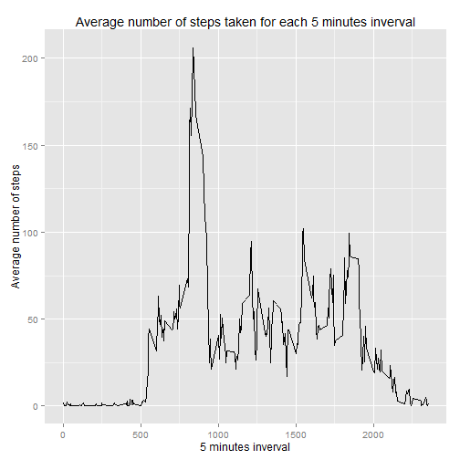
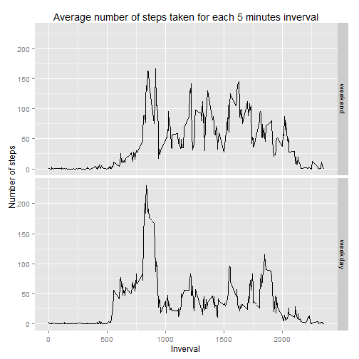

## Loading the packages used
I like to keep all the packages used for the analysis in one place, at the top of the document/code.


```r
if (!require("pacman")){
install.packages("pacman")
}
```

```
## Loading required package: pacman
```

Now we can just list all the packages used here and update this list as analysis proceeds.


```r
pacman::p_load(dplyr, lubridate, ggplot2)
```

## Loading and preprocessing the data
As per the assignment instruction, the data is in csv format. `read.table` can be used to read the data.


```r
actData <- read.csv(unz("activity.zip", "activity.csv"))
```

Check if the entire data is read correctly


```r
dim(actData)
```

```
## [1] 17568     3
```

Okay! That's a relief since there are 17568 observations for 3 variables as mentioned in the assignment statement. Let's check the names of the variables.

```r
names(actData)
```

```
## [1] "steps"    "date"     "interval"
```

How does the data actually look? 


```r
head(actData)
```

```
##   steps       date interval
## 1    NA 2012-10-01        0
## 2    NA 2012-10-01        5
## 3    NA 2012-10-01       10
## 4    NA 2012-10-01       15
## 5    NA 2012-10-01       20
## 6    NA 2012-10-01       25
```


```r
tail(actData)
```

```
##       steps       date interval
## 17563    NA 2012-11-30     2330
## 17564    NA 2012-11-30     2335
## 17565    NA 2012-11-30     2340
## 17566    NA 2012-11-30     2345
## 17567    NA 2012-11-30     2350
## 17568    NA 2012-11-30     2355
```
So we have data from begining of October 2012 until end of November 2012.

However , is the data type for *date* variable correct? It is convinient to apply `as.Date` on it for further processing.


```r
str(actData)
```

```
## 'data.frame':	17568 obs. of  3 variables:
##  $ steps   : int  NA NA NA NA NA NA NA NA NA NA ...
##  $ date    : Factor w/ 61 levels "2012-10-01","2012-10-02",..: 1 1 1 1 1 1 1 1 1 1 ...
##  $ interval: int  0 5 10 15 20 25 30 35 40 45 ...
```

As we can see, *date* variable is of the type *factor*. Let's change it. 


```r
actData$date <- as.Date(as.character(actData$date), "%Y-%m-%d")
```

Check now if all the variables are of the data type we would like them to be. 


```r
str(actData)
```

```
## 'data.frame':	17568 obs. of  3 variables:
##  $ steps   : int  NA NA NA NA NA NA NA NA NA NA ...
##  $ date    : Date, format: "2012-10-01" "2012-10-01" ...
##  $ interval: int  0 5 10 15 20 25 30 35 40 45 ...
```

Yes, they are! *steps* is of the type *int*, *date* is of the type *Date*, and *interval* is of the type *int*.

One point that I noticed from the above `head` and `tail` function calls on the datset is that *steps* variable only showed *NA* values at the begining and end of the dataset. Just out of curiosity, let's see how many values are missing for the variable *steps*.


```r
missPercent <- mean(is.na(actData$steps))*100
```

So around 13.11% of the *steps* values are missing in the dataset provided.

## What is mean total number of steps taken per day?
As instructed, we shall ignore the missing values in the dataset for this part of the assignment.

Calculate total number of steps per day using `group_by` and `summarize` from *dplyr* package.


```r
stepsPerDay <- actData %>%
                group_by(date) %>%
                summarize(totalSteps = sum(steps, na.rm = TRUE))
```

Now we can make histogram of total number of steps taken each day.


```r
ggplot(stepsPerDay, aes(x=totalSteps)) +
    geom_histogram(position = "identity", fill = "red", color = "black", binwidth = 1000) + 
    labs(x = "Total number of steps per day", y = "Count", title = "Histogram of Total number of Steps per day")
```

 

The mean of the total number of steps taken per day is

```r
mean(stepsPerDay$totalSteps, na.rm = TRUE)
```

```
## [1] 9354.23
```

whereas, median of the total number of steps taken per day is

```r
median(stepsPerDay$totalSteps, na.rm = TRUE)
```

```
## [1] 10395
```

    
## What is the average daily activity pattern?
Again we make use of *dplyr* package and calculate the average number of steps taken, averaged across all days after grouping the datset by 5 minutes interval.


```r
stepsPerInterval <- actData %>%
                    group_by(interval) %>% 
                    summarize(aveSteps = mean(steps, na.rm = TRUE))
```

Now it should be fairly straightforward to make the plot.

```r
ggplot(stepsPerInterval, aes(x = interval, y = aveSteps)) +
    geom_line() + 
    labs(x = "5 minutes inverval", y = "Average number of steps", title = "Average number of steps taken for each 5 minutes inverval")
```

 

Use `which.max()` function to find out which 5-minutes interval contains the maximum number of steps.

```r
stepsPerInterval[which.max(stepsPerInterval$aveSteps), ]
```

```
## Source: local data frame [1 x 2]
## 
##   interval aveSteps
## 1      835 206.1698
```
    
## Imputing missing values
1. Calculate and report the total number of missing values in the dataset (i.e. the total number of rows with NAs)

Let's see how many rows have missing values - 


```r
missingData <- !complete.cases(actData)
missingVals <- table(missingData)
print(missingVals[2])
```

```
## TRUE 
## 2304
```

So there are in total 2304 rows containing missing values in the dataset. In order to impute the missing number of steps, we will use the average number of steps taken during that particular 5-minutes interval, averaged across all days.


```r
fillSteps <- function(stepVal, intervalVal){
    finalSteps <- NA
    if(!is.na(stepVal))
        finalSteps <- stepVal
    else
        finalSteps <- stepsPerInterval[stepsPerInterval$interval == intervalVal, ]$aveSteps
    return(finalSteps)
}

newData <- actData

newData$steps <- mapply(fillSteps, actData$steps, actData$interval)
```

Notice that first we defined a function and used it later with `mapply` to fill the missing *NA* values.

To make a histogram similar to one made with the original data, we need to perfrom similar operations with the new dataset *newData*.


```r
newTotalStepsPerDay <- newData %>%
                        group_by(date) %>%
                        summarize(totalSteps = sum(steps))
```

Now plot the histogram


```r
ggplot(newTotalStepsPerDay, aes(x=totalSteps)) +
    geom_histogram(position = "identity", fill = "red", color = "black", binwidth = 1000) + 
    labs(x = "Total number of steps per day", y = "Count", title = "Histogram of Total number of Steps per day (new data)")
```

 

The mean of the total number of steps taken per day with the new data is


```r
mean(newTotalStepsPerDay$totalSteps, na.rm = TRUE)
```

```
## [1] 10766.19
```

whereas, median of the total number of steps taken per day with the new data is


```r
median(newTotalStepsPerDay$totalSteps, na.rm = TRUE)
```

```
## [1] 10766.19
```

As we can see from the comparison of the two histograms, a lot of near-zero total steps values are removed. The mean and the median are exactly the same for the new data, whereas with the presence of missing values, the distibution of total number of steps for each day was a bit skewed to the left.

## Are there differences in activity patterns between weekdays and weekends?

We can use `mutate` to create the new variable for weekend/weekday.


```r
newData <- newData %>% 
    mutate(day = factor(wday(newData$date) %in% c(1,7), levels = c(TRUE, FALSE), labels =c("weekend", "weekday")))
```

Now to make the panel plot of average number of steps taken per 5-minute interval, we can use ggplot2. But first thing first, let's summarize the data in the correct format. 


```r
newAveStepsPerInterval <- newData %>%
                            group_by(day, interval) %>%
                            summarize(aveSteps = mean(steps))
```

Finally the panel plot.


```r
ggplot(newAveStepsPerInterval, aes(x = interval, y = aveSteps)) +
    geom_line() + 
    facet_grid(day ~ .) +
    labs(x = "Inverval", y = "Number of steps", title = "Average number of steps taken for each 5 minutes inverval")
```

 
